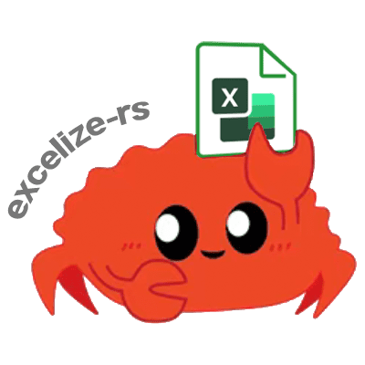

<p align="center"></p>

<p align="center">
    <a href="https://travis-ci.com/xuri/excelize-rs"></a>
    <a href="https://opensource.org/licenses/BSD-3-Clause"></a>
    <a href="https://www.paypal.com/paypalme/xuri"></a>
</p>

# excelize-rs

## Introduction

excelize-rs is a library written in pure Rust providing a set of functions that allow you to write to and read from XLSX / XLSM / XLTM files. Supports reading and writing spreadsheet documents generated by Microsoft Excel&trade; 2007 and later.

## Reading spreadsheet

The following constitutes the bare to read a spreadsheet document.

```rust
extern crate excelize_rs;

use excelize_rs::*;

fn main() {
    let path = String::from("Book1.xlsx");
    let wb = Spreadsheet::open_file(path);
    match wb {
        Ok(ws) => match ws.get_cell_value("Sheet1", 1, 1) {
            Ok(c) => {
                let cell = String::from(c);
                println!("the value of cell A1 is: {}", cell)
            }
            Err(e) => println!("{:?}", e),
        },
        Err(e) => print!("{:?}", e),
    }
}
```

## Contributing

Contributions are welcome! Open a pull request to fix a bug, or open an issue to discuss a new feature or change. XML is compliant with [part 1 of the 5th edition of the ECMA-376 Standard for Office Open XML](http://www.ecma-international.org/publications/standards/Ecma-376.htm).

## Licenses

This program is under the terms of the BSD 3-Clause License. See [https://opensource.org/licenses/BSD-3-Clause](https://opensource.org/licenses/BSD-3-Clause).
